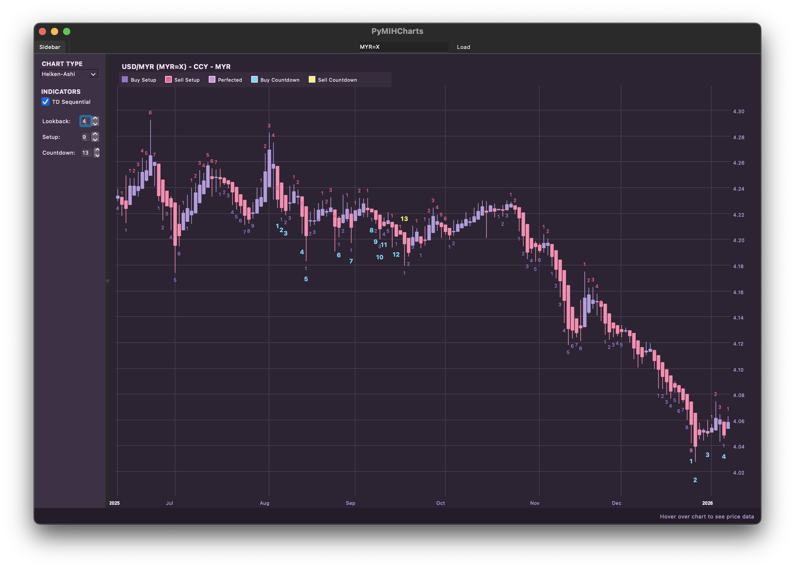

# PyMIHCharts

A high-performance, native Python desktop application for professional technical analysis. While originally focused on TD Sequential, PyMIHCharts is evolving into a comprehensive charting suite with a growing library of technical indicators.



## Key Features

- **Modern Native UI (Qt6)**:
    - **Property Browser Sidebar**: An "Accordion" style settings panel with **collapsible sections** for a clean, organized workspace.
    - **Unified Toolbar**: Native macOS-style toolbar integration for seamless interaction.
    - **Explicit Search**: Dedicated **Search** button for manual ticker discovery via `yfinance`.
    - **Adjustable Layout**: **Splitter** control allows dynamic resizing of the chart and sidebar areas.
    - **Dynamic Typography**: Real-time control over application-wide font sizes and relative chart text offsets.
    - **Polished Controls**: Standardized form layouts and native widgets for a professional look and feel.
    - **Adaptive Axis**: Date and Price axes that intelligently scale and format based on zoom levels.
    - **Advanced Interactions**: Mouse wheel zoom, click-drag panning, and **Pinch-to-Zoom** for touch devices.
- **Data Integration**: Automatic historical daily data downloads via `yfinance`.
- **Smart Symbol Search**: If a ticker symbol is not found, the app automatically queries `yfinance` for matches and presents a selection dialog, ensuring users always find the right asset.
- **Enhanced Status Bar**: Real-time, color-coded price data (O, H, L, C) displayed in a bolded, rich-text format.
- **Dynamic Theme Engine**: Support for multiple color schemes including **Default**, **Lilac** (soft aesthetic), and **Dracula**, switchable at any time via the "View" menu.
- **Multi-Chart Type Rendering**:
    - **Native Candlestick**: High-performance rendering of traditional candles.
    - **OHLC Bar Chart**: Classic representation of Open, High, Low, and Close data.
    - **Line Chart**: Minimalist view using closing prices.
    - **Heiken-Ashi Candles**: Vectorized trend-smoothing visualization.
- **Bollinger Bands**: High-performance implementation of volatility bands with:
    - Custom periods and Moving Average types (SMA/EMA).
    - Support for multiple concurrent Standard Deviation bands (1σ, 2σ, 3σ).
- **Advanced TD Sequential Logic**: Full implementation including Price Flips, Setup (1-9), Setup Perfection, TDST levels, and Countdown (1-13) with the 13-vs-8 qualifier and deferral (+).

## Installation

### Prerequisites
- Python 3.8+
- Linux (X11/Wayland), Windows, or macOS

#### Quick Start (Linux)
1. Run the automated setup script: `./setup.sh`
2. Launch: `./run.sh`

### Quick Start (macOS)
1. Run the automated setup script: `./setup_macos.sh`
2. Launch: `./run.sh`

### Quick Start (Windows)
**Using Command Prompt:**
1. Run: `setup.bat`
2. Launch: `run.bat`

**Using PowerShell:**
1. Run: `./setup.ps1`
2. Launch: `./run.ps1`

*Manual Setup:*
```bash
python3 -m venv venv
source venv/bin/activate
pip install -r requirements.txt
python3 main.py
```

## Architecture
PyMIHCharts is built using a professional **Model-View-Controller (MVC)** architecture with a fully asynchronous processing engine.

- **Model**: High-performance vectorized math and threaded data workers for non-blocking performance.
- **View**: Responsive, layout-driven native PySide6 rendering engine.
- **Controller**: Real-time signal coordination between the UI and background processing threads.

## How to Use
1. Enter a stock or crypto ticker (e.g., `AAPL`, `BTC-USD`) in the input field.
2. Click **Load** to fetch data or **Search** to find similar symbols using partial names or tickers.
3. Expand the **CHART TYPE** section in the sidebar to switch between Candlestick, OHLC, Line, or Heiken-Ashi.
4. Expand the **INDICATORS** section to toggle **TD Sequential** or **Bollinger Bands** and adjust their specific parameters.
5. Expand the **FONT SIZES** section at the bottom of the sidebar to dynamically scale the UI and chart text.
6. Use the **Mouse Wheel** to zoom (or **Pinch-to-Zoom** if a touchscreen is available) and **Left-Click + Drag** to scroll.
7. Hover over any bar to trigger the **Snapping Crosshair** and see detailed price info at the bottom right.

## TD Sequential Trading Strategy

TD Sequential is designed to identify price exhaustion points and potential reversals based on Tom DeMark's research.

### 1. The Setup (9 Counts)
- **Goal**: Identifies a short-term overextended trend.
- **Signal**: A completed **Green 9 (Buy Setup)** or **Red 9 (Sell Setup)** suggests a momentary pause or reversal (typically for 1-4 bars).
- **Perfection**: A Setup is "Perfected" (highlighted in **Magenta**) when the high/low of bar 8 or 9 exceeds the extreme of bars 6 and 7. DeMark suggests waiting for perfection before anticipating a reversal.

### 2. TDST Levels (Support/Resistance)
- **Definition**: The highest high (for Buy Setups) or lowest low (for Sell Setups) occurring within a completed Setup 1-9.
- **Usage**: These levels act as critical support or resistance lines.
    - **Reversal**: If price respects the TDST level, the counter-trend signal is reinforced.
    - **Continuation**: If price closes decisively beyond the TDST level, the current trend is strong, and the Setup signal is likely invalid (suggesting trend continuation).

### 3. The Countdown (13 Counts)
- **Goal**: Identifies longer-term trend exhaustion (major top or bottom).
- **Signal**: A completed **13 Countdown** indicates the trend has likely depleted its momentum.
- **Qualifier**: This app enforces the "13 vs 8" qualifier (Close of bar 13 must be better than Close of bar 8) and displays a "13+" (deferred) if the condition isn't met yet.

## Bollinger Bands Trading Strategy

Bollinger Bands are a volatility-based tool developed by John Bollinger to identify overbought/oversold conditions and trend strength.

### 1. The Squeeze (Volatility)
- **Goal**: Identifies periods of low volatility as precursors to major price moves.
- **Signal**: When the upper and lower bands constrict (the "Squeeze"), it indicates that volatility is unusually low. This typically leads to a "Volatility Breakout."
- **Usage**: Traders wait for a price break above or below the bands following a squeeze to enter a trade in the direction of the breakout.

### 2. Walking the Bands (Trend)
- **Goal**: Identifies strong trending momentum.
- **Signal**: In a strong trend, price will often "walk" along the upper band (uptrend) or lower band (downtrend).
- **Usage**: Touching the bands is not a signal by itself; rather, continued closes outside or near the bands suggest trend strength. A move back toward the middle band (Moving Average) might indicate a temporary pullback or trend exhaustion.

### 3. W-Bottoms and M-Tops (Reversals)
- **Goal**: Identifies high-probability reversal patterns.
- **W-Bottom**: Occurs when price makes a low outside the lower band, followed by a bounce, and then a second low *inside* the lower band. This "higher low" relative to the bands suggests a bullish reversal.
- **M-Top**: Occurs when price makes a high outside the upper band, followed by a pullback, and then a second high *inside* the upper band. This suggests momentum is fading despite the high price, indicating a bearish reversal.

## Disclaimer

This software is for **educational and informational purposes only**. It does not constitute financial, investment, or trading advice. Technical analysis indicators are based on historical data and do not guarantee future results. 

The authors and contributors of PyMIHCharts are not responsible for any financial losses or damages incurred through the use of this application. Users should perform their own due diligence and consult with a certified financial advisor before making any investment decisions. **Trading involves significant risk.**

## License

This project is licensed under the [Parity Public License 7.0.0](LICENSE.md).
